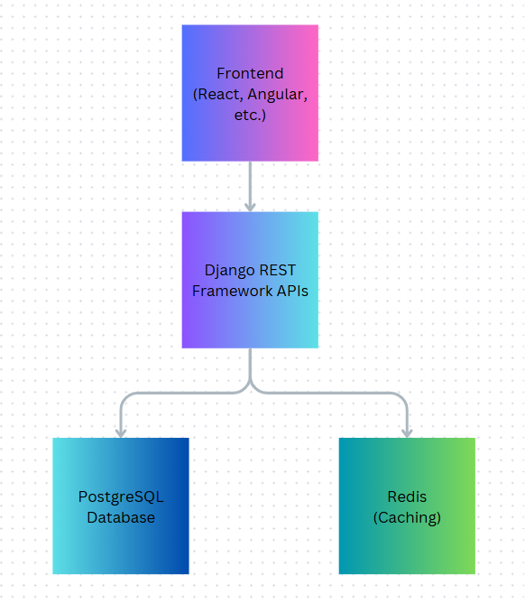

# Scalable E-Commerce Platform

This project is a scalable e-commerce platform built using Django REST Framework and PostgreSQL, designed to handle complex queries and asynchronous tasks. It will be deployed on AWS Elastic Beanstalk.

## Roadmap

1. **Phase 1: Project Initialization**
   - Set up the repository and environment.
   - Initialize the Django project with basic settings.

2. **Phase 2: User Authentication**
   - Implement user registration, login, and logout functionality using JWT.
   - Test authentication endpoints.

3. **Phase 3: Product Catalog**
   - Build models for products and categories.
   - Develop APIs for CRUD operations.
   - Implement search and filtering features.

4. **Phase 4: Cart and Orders**
   - Create models for cart, cart items, and orders.
   - Build APIs for managing carts and placing orders.

5. **Phase 5: Deployment on AWS**
   - Deploy the application on AWS Elastic Beanstalk.
   - Set up PostgreSQL using AWS RDS.

6. **Phase 6: Additional Features**
   - Integrate Celery for task queues (e.g., email notifications).
   - Use Redis for caching.

7. **Phase 7: Final Showcase**
   - Polish the project with detailed documentation and examples.
   - Add tests and optimize for scalability.

---

## Architecture Diagram

Below is the high-level architecture of the Scalable E-Commerce Platform:



---

## Authentication Features

The application uses JWT for secure authentication. Below are the endpoints:

1. **Register a User:**
   - **Endpoint:** `/api/auth/register/`
   - **Method:** POST
   - **Request Body:**
     ```json
     {
       "username": "testuser",
       "email": "test@example.com",
       "password": "testpassword"
     }
     ```
   - **Response:**
     ```json
     {
       "id": 1,
       "username": "testuser",
       "email": "test@example.com"
     }
     ```

2. **Login:**
   - **Endpoint:** `/api/auth/login/`
   - **Method:** POST
   - **Request Body:**
     ```json
     {
       "username": "testuser",
       "password": "testpassword"
     }
     ```
   - **Response:**
     ```json
     {
       "access": "jwt_access_token",
       "refresh": "jwt_refresh_token"
     }
     ```

3. **Refresh Token:**
   - **Endpoint:** `/api/auth/token/refresh/`
   - **Method:** POST
   - **Request Body:**
     ```json
     {
       "refresh": "jwt_refresh_token"
     }
     ```
   - **Response:**
     ```json
     {
       "access": "new_jwt_access_token"
     }
     ```

---

## Product Catalog Features

The product catalog allows CRUD operations for categories and products, with search and filtering features.

### Categories API

1. **List All Categories:**
   - **Endpoint:** `/api/categories/`
   - **Method:** GET
   - **Response:**
     ```json
     [
       {
         "id": 1,
         "name": "Electronics",
         "description": "Electronic items"
       }
     ]
     ```

2. **Retrieve a Category:**
   - **Endpoint:** `/api/categories/{id}/`
   - **Method:** GET
   - **Response:**
     ```json
     {
       "id": 1,
       "name": "Electronics",
       "description": "Electronic items"
     }
     ```

3. **Create a Category:**
   - **Endpoint:** `/api/categories/`
   - **Method:** POST
   - **Request Body:**
     ```json
     {
       "name": "Electronics",
       "description": "Electronic items"
     }
     ```
   - **Response:**
     ```json
     {
       "id": 2,
       "name": "Electronics",
       "description": "Electronic items"
     }
     ```

4. **Update a Category:**
   - **Endpoint:** `/api/categories/{id}/`
   - **Method:** PUT
   - **Request Body:**
     ```json
     {
       "name": "Home Appliances",
       "description": "Appliances for home use"
     }
     ```
   - **Response:**
     ```json
     {
       "id": 1,
       "name": "Home Appliances",
       "description": "Appliances for home use"
     }
     ```

5. **Delete a Category:**
   - **Endpoint:** `/api/categories/{id}/`
   - **Method:** DELETE

### Products API

1. **List All Products:**
   - **Endpoint:** `/api/products/`
   - **Method:** GET
   - **Response:**
     ```json
     [
       {
         "id": 1,
         "name": "Laptop",
         "description": "High-end gaming laptop",
         "price": "1500.00",
         "category": 1,
         "stock": 10,
         "created_at": "2025-01-15T06:31:38.809214Z",
         "updated_at": "2025-01-15T07:02:53.076779Z"
       }
     ]
     ```

2. **Retrieve a Product:**
   - **Endpoint:** `/api/products/{id}/`
   - **Method:** GET

3. **Create a Product:**
   - **Endpoint:** `/api/products/`
   - **Method:** POST
   - **Request Body:**
     ```json
     {
       "name": "Smartphone",
       "description": "Latest model smartphone",
       "price": "999.99",
       "category": 1,
       "stock": 50
     }
     ```

4. **Update a Product:**
   - **Endpoint:** `/api/products/{id}/`
   - **Method:** PUT
   - **Request Body:**
     ```json
     {
       "name": "Smartphone",
       "description": "Updated smartphone description",
       "price": "899.99",
       "category": 1,
       "stock": 45
     }
     ```

5. **Delete a Product:**
   - **Endpoint:** `/api/products/{id}/`
   - **Method:** DELETE

6. **Search Products:**
   - **Endpoint:** `/api/products/?search={query}`
   - **Method:** GET

7. **Order Products:**
   - **Endpoint:** `/api/products/?ordering=price`
   - **Method:** GET

---

## Setup and Running the Project

### Prerequisites
- Python 3.9 or higher
- pip
- Virtual environment (recommended)

### Steps to Run the Project
1. **Clone the Repository:**
   ```bash
   git clone https://github.com/your-username/scalable-ecommerce-platform.git
   cd scalable-ecommerce-platform
